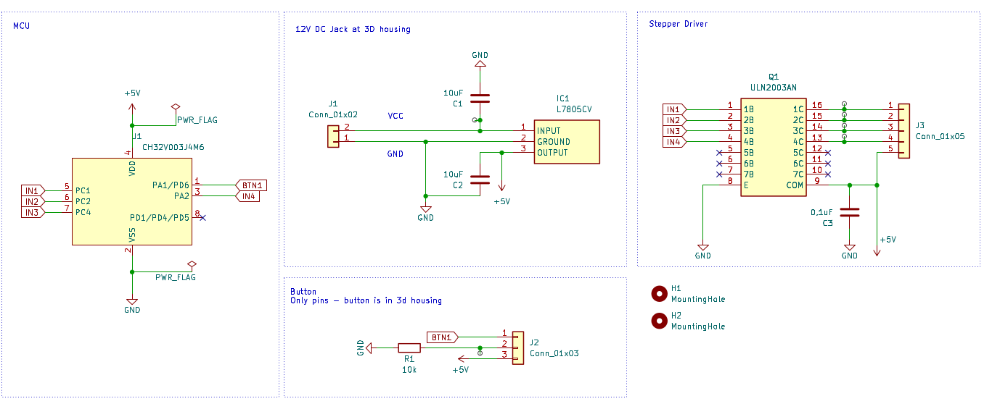

The original Design and Idea comes from Basement Creations: https://www.printables.com/de/model/156547-rotating-display-table/files

## General info 

A simple stepper control without any library.
I've used my Button Class - but you can skip it and include your own button control logic.
The main code for the stepper control is very simple.

* CH32v003J4M6
* 28BYJ-48
* 12V DC Jack
* Pushbutton
* 3x ball bearings

## Stepper control
#### Stepping Through Motor Phases
- The `for` loop (`for (int i = 0; i < 4; i++)`) represents the steps needed to rotate the motor. Each iteration of this loop moves the motor to the next phase.

#### Setting Motor Pin States
- `digitalWrite(in1, (steps[i][0] == HIGH) ? HIGH : LOW);` (and similar lines for `in2`, `in3`, `in4`): These lines set the state of motor control pins. Depending on the step, each pin is turned ON (HIGH) or OFF (LOW). This pattern is crucial for controlling the motor's movement.

#### Delay for Speed Control
- `delay(delayTime);`: This line creates a pause between each step. The length of the delay controls how fast the motor turns. Shorter delays make the motor turn faster.

#### Reset Pins
- After each step, all control pins are turned OFF (`LOW`). This reset is important for the next cycle of steps and to prevent any potential issues with the motor.

## 3D Design
A fantastic Design which I remixed:

My Remix includes:
* closed the hole on the bottom.
* added 12V Power Jack and Button

https://www.printables.com/de/model/656756-rotating-table

## Wiring: 

You like it? Then I would be very happy if you treat me to a coffee on [ko-fi.com/pixeledi](https://www.ko-fi.com/pixeledi)
